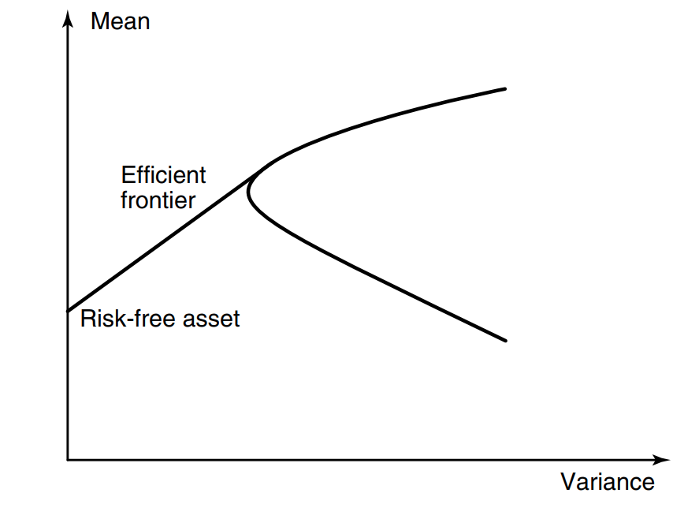

```{r setup, include=FALSE}
knitr::opts_chunk$set(echo = FALSE, fig.align="center")
```

# Modern Portfolio Theory

## Mean-Variance Portfolio Optimization

- Sharpe and Markowitz (1960s)
- Maximize Expected Arithmetic Returns subject to a variance constraint
- Modern portfolio theory tries to estimate expected return mean and variance of various stocks
-- Implicit in this assumption is that the return distribution is *Gaussian*, and can be estimated from empirical history of a stock
- These estimates are inputs into an optimization model that allocates portfolio fractions subject to overall portfolio risk
-- Variance of the returns is thought of as "risk"

## Mathematical Formulation

$$ Let \; b_i \; = \; the \; portfolio \; fraction \; invested \; in \; the \; i^{th} \; stock, \; \sum_{i=1}^{N} b_i = 1$$
$$Assume \; each \; stock \; is\; Gaussian \; and \; Independent: \; N(\mu_i, \sigma_i)$$
$$\mu_i = mean\; expected\; return\; from\; i^{th}\; stock $$
$$\sigma_i = variance\; of\; i^{th}\; stock $$
$$---$$
$$maximize \; \sum_{i=1}^{N} b_i\mu_i $$
$$s.t. \; \sigma_{portfolio} < \sigma_{max}$$

## Efficient Frontier

- As you tweek desired portfolio variance, the expected return of the new portfolio will go up (high risk, high return)

{width=175px, height=175px}

## Shortcomings

-
-
-

# The Kelly Criterion

## Derivation

- 
- 
-

## Why was this so different?

- 
- 
-

## Samuelson's Criticisms

- 
- 
-

# Shannon's Demon

- 
- 
-

# Cover's Universal Portfolio

## Some primitives from Information Theory and Data Compression

- 
- 
-

## Basic Idea of Universal Portfolio

- 
- 
-

## Why does this work?

- 
- 
-

## Some examples

- 
- 
-

# Speculations

- 
- 
-


